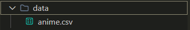
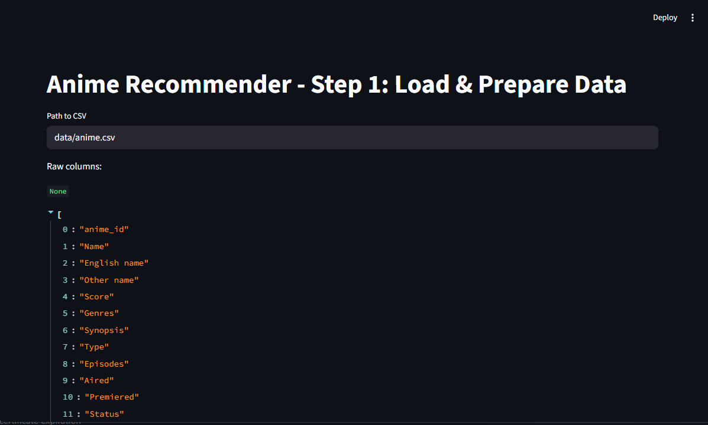

# Learning Vector Databases and training a basic AI model

## Premise
We are going to build an a vector database that we will use to perform semantic search.

Our dataset requires metadata with something like a synopsis.

Descriptive search needs these because things like "title" don't have a good SEMANTIC signal.

An example would be dark horror anime: titles can be completely unalike in a lot of cases but a synopsis gives us a lot more to work with.

## Requirements
Clean dataset with good semantic capabilities for your task.

Please have VSCode installed: https://code.visualstudio.com/

Guide to install python: (MAKE SURE TO ADD TO PATH!
https://www.geeksforgeeks.org/python/download-and-install-python-3-latest-version/

Python PIP install: run this for pip after installing python `python -m pip install --upgrade pip`

May need to create a virtual environment try this:
`python3 -m venv path/to/venv
    source path/to/venv/bin/activate`

## Dev Notes

### Python Packages
* streamlit - simple easy frontend UI for Python apps
* pandas - for dataset operations
* sentence-transformers - transforms data into high-dimensional vectors (embeddings) to be used by the AI. SentenceTransformer module is a pretrained embedding model that can be run locally without requiring an API key.
* chromadb - an open-source vector database for storing, searching, and managing vector embeddings. Enables fast similarity search and offers a simple API for devs making it well-suited for building and deploying AI-driven applications.

## Steps
0. Create an empty folder as the working directory for the project and open it in your IDE of choice.
1. Create a requirements.txt file that has: 
````
streamlit
pandas
sentence-transformers
chromadb
````
2. Create a folder called data and place your dataset .csv file into it.
3. In app.py import your dependencies at the top
````
import pandas as pd
import streamlit as st
from sentence_transformers import SentenceTransformer
import chromadb
````
4. In app.py, create a streamlit page and add a title to the streamlit page and create a variable csv_path to store the path to the dataset.
````
st.set_page_config(page_title="Anime Recommender (Vector Search)", layout="wide")

st.title("Anime Recommender - Step 1: Load & Prepare Data")

csv_path = st.text_input("Path to CSV", "data/anime.csv")
```` 
5. Run `pip install -r requirements.txt` and `streamlit run app.py` to see what we just made. It should look like the below screenshot
6. In app.py, create load_csv function:
````
@st.cache_data # Stores result of load_csv into streamlit's cache
def load_csv(path: str):
    df = pd.read_csv(path)
    return df
````
7. Create try except block in app.py to use the load_csv function and display the columns read in streamlit
````
try:
  # Load csv and display raw data
  df = load_csv(csv_path)
  st.write("Raw columns:", list(df.columns))

except Exception as e:
  st.exception(e)
````
It should look like this: 
8. Run `streamlit run app.py` to see changes 
9. In app.py under the def load_csv function, define normalize_columns function to prep the dataframe for the transformer 
````
def normalize_columns(df: pd.DataFrame) -> pd.DataFrame:
    df = df.copy()

    # Ensure required columns exist (failing early with error if needed)
    required = ["anime_id", "Name", "Genres", "Synopsis"]
    missing = [c for c in required if c not in df.columns]
    if missing:
        raise ValueError(f"CSV is missing required columns: {missing}")

    # Fill NaNs so string concatenation doesn't produce 'nan'
    for col in ["Name", "English name", "Other name", "Genres", "Synopsis", "Type", "Aired"]:
        if col in df.columns:
            df[col] = df[col].fillna("").astype(str)

    # For code cleanliness: process episodes col separate because it might be int and the others are strings
    if "Episodes" in df.columns:
        df["Episodes"] = df["Episodes"].fillna("").astype(str)

    # Build the text that will be embedded later
    df["doc_text"] = (
        df["Name"].str.strip()
        + ". Also known as: "
        + df.get("English name", "").astype(str).str.strip()
        + "; "
        + df.get("Other name", "").astype(str).str.strip()
        + ". Genres: "
        + df["Genres"].str.strip()
        + ". Type: "
        + df.get("Type", "")
        + ". Episodes: "
        + df.get("Episodes", "")
        + ". Synopsis: "
        + df["Synopsis"].str.strip()
    )

    return df
````
10. In app.py, expand the try block with another dataframe that will store the normalized values and display it in streamlit. The try block should look like this now:
````
try:
    # Load csv and display raw data
    df = load_csv(csv_path)
    st.write("Raw columns:", list(df.columns))

    # Normalize data for nan's
    df2 = normalize_columns(df)

    # Display top 20 of the normalized dataset for debug
    st.subheader("Dataset preview")
    st.dataframe(df2[["anime_id", "Name", "Genres", "Type", "Episodes"]].head(20))

    # Display example text used for embedding debug
    st.subheader("Example `doc_text` (what will be embedded)")
    st.code(df2["doc_text"].iloc[0])

    st.write("Rows:", len(df2))
````
11. Run `streamlit run app.py` to see changes 
12. In app.py under the def normalize_columns function, create functions to get the transformer to embed our text into vectors and to create a chromadb vector database:
````
@st.cache_resource #Caches the embedding model across reruns (the model is heavyweight)
def get_embedder(model_name: str) -> SentenceTransformer:
    return SentenceTransformer(model_name)

def get_chroma_client(persist_dir: str) -> chromadb.PersistentClient:
    return chromadb.PersistentClient(path=persist_dir)
````
13. Create function to build the vector database using sentence transformers from our dataset under the two definitions we made last step.
````
def build_or_load_collection(df: pd.DataFrame, persist_dir: str, collection_name: str):
    client = get_chroma_client(persist_dir)
    collection = client.get_or_create_collection(name=collection_name)

    # If already populated, don't re-add on every rerun
    existing = collection.count()
    if existing > 0:
        return collection

    # Ingestion logic if collection is not populated
    embedder = get_embedder("all-MiniLM-L6-v2")

    # Chroma requires unique string ID per item
    # documents: the text
    # converts the columns to a python list to be added to collection and for embedding (documents)
    ids = df["anime_id"].astype(str).tolist()
    documents = df["doc_text"].tolist()

    # Store minimal metadata you want to display later
    # df.iterrows() Might be a little slow but fine for small datasets
    # For faster builds in the future use vectorized pandas operations
    metadatas = []
    # df.iterrows() returns (index, row)
    # the purpose of for _, row is to acknowledge for readability that we are NOT using index
    # in practicality we could do for index, row in df.iterrows() and it'll be the same functionally
    # In the code we only use row because we don't really need to use the index
    for _, row in df.iterrows():
        metadatas.append(
            {
                "Name": row.get("Name", ""),
                "Genres": row.get("Genres", ""),
                "Type": row.get("Type", ""),
                "Score": str(row.get("Score", "")),
            }
        )

    # Encode in batches to avoid high memory usage
    batch_size = 256
    for start in range(0, len(documents), batch_size):
        end = start + batch_size
        batch_docs = documents[start:end]
        batch_ids = ids[start:end]
        batch_meta = metadatas[start:end]

        # embeddings: the vectors (computed from the documents)
        # THIS IS THE MAGIC!
        embeddings = embedder.encode(batch_docs).tolist()

        # add the results to the collection
        collection.add(
            ids=batch_ids,
            documents=batch_docs,
            metadatas=batch_meta,
            embeddings=embeddings,
        )

    return collection
````
14. Finish the try block by creating streamlit UI elements to query the database and display it.
````
try:
    # Load csv and display raw data
    df = load_csv(csv_path)
    st.write("Raw columns:", list(df.columns))

    # Normalize data for nan's
    df2 = normalize_columns(df)

    # Display top 20 of the normalized dataset for debug
    st.subheader("Dataset preview")
    st.dataframe(df2[["anime_id", "Name", "Genres", "Type", "Episodes"]].head(20))

    # Display example text used for embedding debug
    st.subheader("Example `doc_text` (what will be embedded)")
    st.code(df2["doc_text"].iloc[0])

    st.write("Rows:", len(df2))

    # Front end UI to build chroma vector database using our dataset
    st.subheader("Vector index")
    # Text input to ask where to store chromadb
    persist_dir = st.text_input("Chroma persist directory", "chroma_store")
    # Names the collection/bucket inside Chroma where your vectors live
    collection_name = st.text_input("Collection name", "anime")

    # Creates UI button to build collection (runs our function)
    if st.button("Build / Load Vector DB"):
        collection = build_or_load_collection(df2, persist_dir, collection_name)
        st.success(f"Collection ready. Items in collection: {collection.count()}")

    # Query section used to query the vector database
    st.subheader("Search")
    query = st.text_input("Describe what you want to watch")
    k = st.slider("How many recommendations?", 1, 20, 10)
    if st.button("Recommend"):
        # Makes sure collection is loaded first
        collection = build_or_load_collection(df2, persist_dir, collection_name)
        embedder = get_embedder("all-MiniLM-L6-v2")

        # Encodes the query for the model to ingest similar to how we made ingested the data
        # Why the [query] and [0]?
        # encode() is batch-oriented; it returns a list/array of vectors.
        # You pass a list of 1 string, so it returns a list of 1 vector.
        # [0] extracts that single vector.
        q_embedding = embedder.encode([query]).tolist()[0]

        # collection.query performs a nearest-neighbor search in vector space
        # Inputs:
        # query_embeddings=[q_embedding]: list of query vectors (we have 1)
        # n_results=k: how many neighbors to return
        # include=[...]: what extra fields to return
        results = collection.query(
            query_embeddings=[q_embedding],
            n_results = k,
            include=["metadatas", "documents", "distances"],
        )

        # for the selected number of nearest neighbors (results) to return:
        # Since you queried with one embedding, you access the first query’s results with [0].
        # Then [i] picks the i-th neighbor.
        for i in range(k):
            meta = results["metadatas"][0][i]
            dist = results["distances"][0][i] # distance is how close the result is to the query
            doc = results["documents"][0][i]
            # results["metadatas"][0] is a list of length k
            # results["metadatas"][0][i] is the dict for result i
    
            st.markdown(f"### {meta.get('Name', 'Unknown')}  \n**Distance:** `{dist:.4f}`")
            st.write("Genres:", meta.get("Genres", ""))
            st.write("Type:", meta.get("Type", ""), "Score:", meta.get("Score", ""))
            st.caption(doc[:400] + "...")
````

## Improvements to Recommendation Quality (Ideas for Next Iterations)

### 1) Use a Better Embedding Model (Biggest “one-line” improvement)
Right now the system uses `all-MiniLM-L6-v2`, which is fast and decent, but not the best for retrieval.

- Try stronger embedding models
  - `sentence-transformers/all-mpnet-base-v2`
  - `BAAI/bge-base-en-v1.5` (or `bge-small-en-v1.5` for speed)
  - `intfloat/e5-base-v2` / `e5-small-v2`

- Note
  - If you change the embedding model, you must rebuild the vector database, since all stored vectors change.

### 2) Improve the Text You Embed (`doc_text`) (Better “features”)
Embedding quality depends heavily on what text you feed the model.

- Reduce noise
  - Avoid embedding fields like `Score` directly into `doc_text` (use it later for filtering/ranking instead).

- Add structure
  - Format the embedded text in a consistent schema-like way, e.g.:
    - `Title: ...`
    - `Genres: ...`
    - `Type: ...`
    - `Synopsis: ...`

- Normalize categories
  - Standardize genre formatting (lowercase, consistent separators).

### 3) Add Hybrid Ranking (Semantic Similarity + Rules + Signals)
Vector similarity alone can return items that are “close” semantically but still not what the user wants.

- Hard filters
  - Filter by `Type` (TV vs Movie)
  - Minimum `Score`
  - Episode range (e.g., exclude extremely long series if user wants short)

- Soft boosts
  - Boost results with overlapping genres
  - Boost higher-scored anime as a tie-breaker
  - Penalize type mismatches instead of filtering them out

### 4) Two-Stage Retrieval + Reranking (Industry Standard Pattern)
A common production approach:

- Stage 1 (Retrieval): vector search returns top 50–200 candidates quickly
- Stage 2 (Reranking): a better model reranks those candidates for quality

- Reranking options
  - Cross-encoder reranker (SentenceTransformers cross-encoders often improve relevance a lot)
  - LLM-based reranking (best quality, higher cost/latency)

### 5) Add Personalization (Makes it a “recommender”, not just search)
Prompt-based similarity is great, but personalization usually improves usefulness.

- User taste vector
  - Let the user pick 3–10 anime they like
  - Average (or weighted-average) those embeddings into one “taste” embedding
  - Query the vector DB using that taste embedding

- Negative preferences
  - Allow “disliked” items
  - Subtract/penalize their embeddings or filter their genres/themes

### 6) Add an Evaluation Loop (So improvements are measurable)
To iterate intelligently, create a small evaluation harness:

- Create a fixed set of test queries
  - e.g., “psychological thriller mind games”, “cozy slice of life”, “cyberpunk dystopia”
- Track quality manually
  - Mark results as good/bad
  - Compare before/after model changes or `doc_text` changes

## Industry Examples (Conceptual Parallels)

### Netflix-style (Candidate Generation → Ranking → Post-processing)
- Candidate generation: fast retrieval (embeddings + behavior-based methods)
- Ranking: heavier model predicts engagement for the user
- Post-processing: diversity, freshness, business constraints

### YouTube/TikTok-style (Two-stage + Feedback Loop)
- Retrieve a large set of candidates
- Rank based on watch-time/engagement prediction
- Continuous improvement using real-time behavior feedback

### Amazon-style (Hybrid Search + Rules)
- Combine:
  - keyword/lexical matching
  - semantic vector retrieval
  - business rules and constraints
- Use reranking heavily for relevance and conversion

### Spotify-style (Blended Recommenders)
- Multiple systems combined:
  - collaborative filtering
  - content embeddings
  - editorial/rules
  - exploration/diversity mechanisms