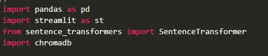
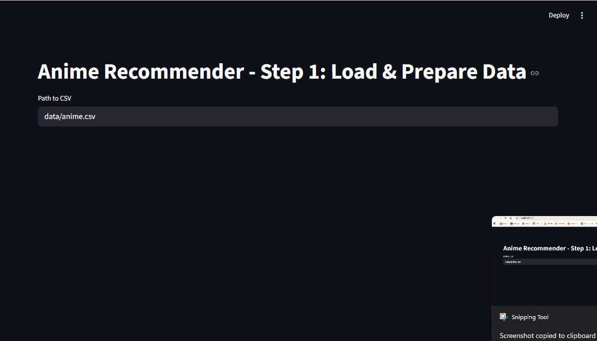
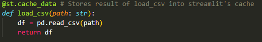
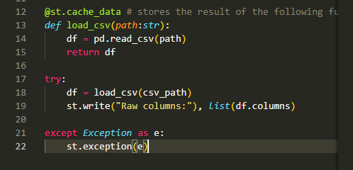
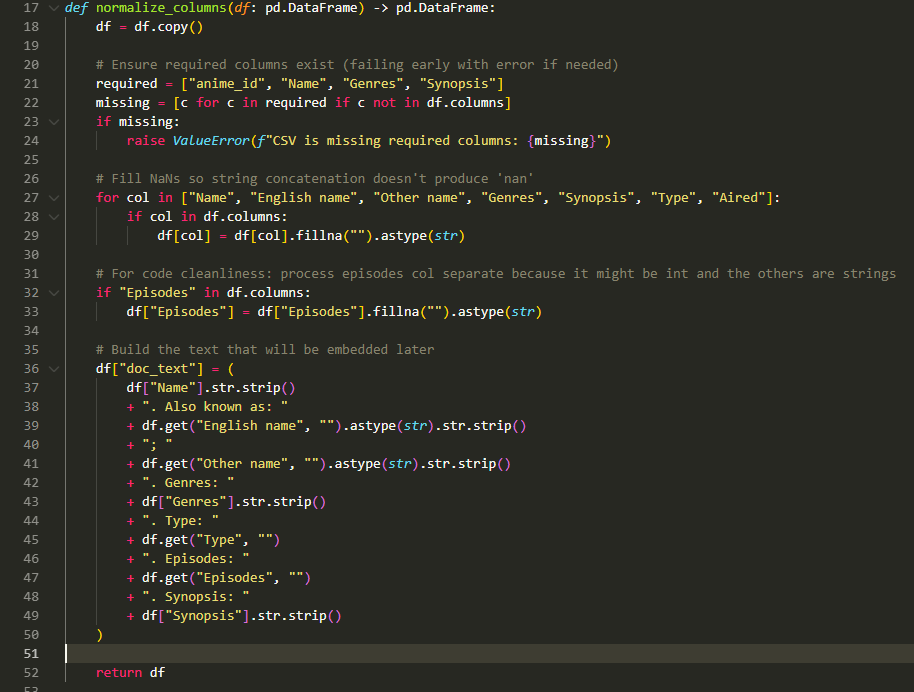
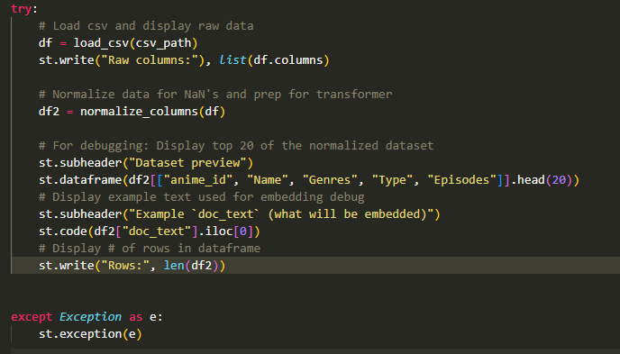
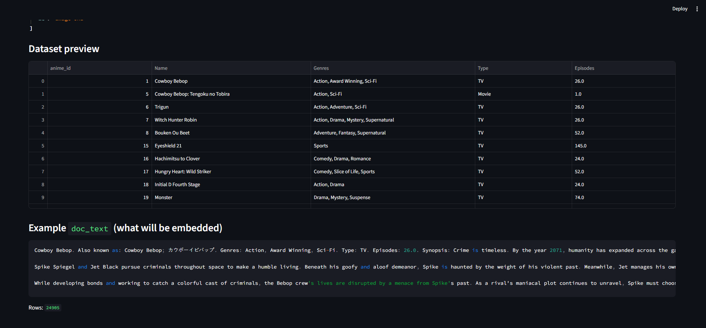
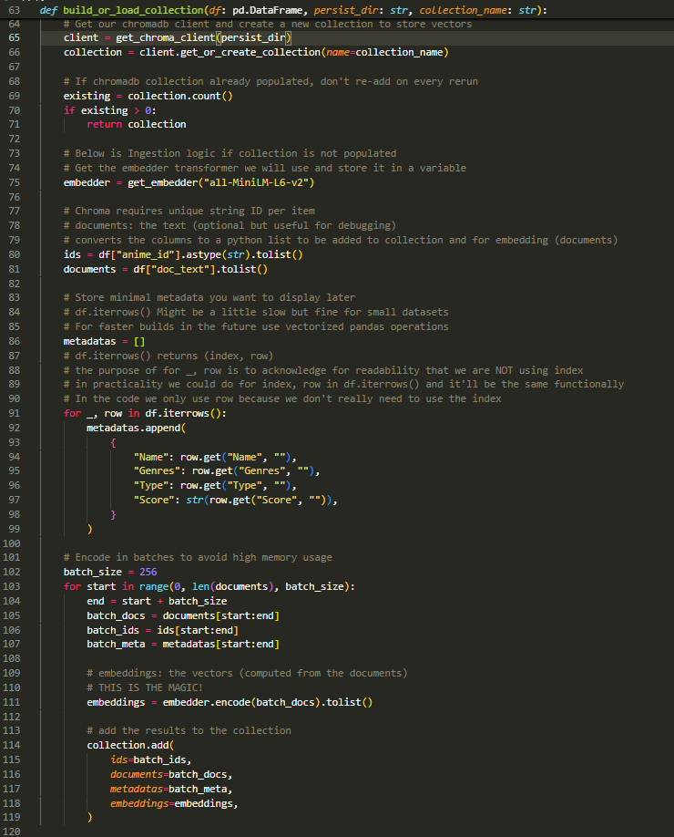

# Learning Vector Databases and training a basic AI model

## Premise
We are going to build an a vector database that we will use to perform semantic search.

Our dataset requires metadata with something like a synopsis.

Descriptive search needs these because things like "title" don't have a good SEMANTIC signal.

An example would be dark horror anime: titles can be completely unalike in a lot of cases but a synopsis gives us a lot more to work with.

## Requirements
Clean dataset with good semantic capabilities for your task.

A computer with python and pip: run this for pip after installing python `python -m pip install --upgrade pip`

May need to create a virtual environment try this:
`python3 -m venv path/to/venv
    source path/to/venv/bin/activate`

## Dev Notes

### Python Packages
* streamlit - simple easy frontend UI for Python apps
* pandas - for dataset operations
* sentence-transformers - transforms data into high-dimensional vectors (embeddings) to be used by the AI. SentenceTransformer module is a pretrained embedding model that can be run locally without requiring an API key.
* chromadb - an open-source vector database for storing, searching, and managing vector embeddings. Enables fast similarity search and offers a simple API for devs making it well-suited for building and deploying AI-driven applications.

## Steps
1. Create a requirements.txt file that has: streamlit
pandas
sentence-transformers
chromadb
2. Create a folder called data and place your dataset .csv file into it.
3. In app.py import your dependencies 
4. Create a streamlit page and add a title to the streamlit page.
5. Create a variable csv_path to store the path to the dataset.
6. Run `pip install -r requirements.txt` and `streamlit run app.py` to see what we just made. 
7. Create load_csv function 
8. Create try except block to use the load_csv function and display the columns read in streamlit 
9. Run `streamlit run app.py` to see changes 
10. Create normalize_columns function to prep the dataframe for the transformer 
11. Add to try block another dataframe that will store the normalized values and display it in streamlit 
12. Run `streamlit run app.py` to see changes 
13. Create functions to get the transformer to embed our text into vectors and to create a chromadb vector database
14. Create function to build the vector database using sentence transformers from our dataset 
15. Finish the try block 

## Improvements to Recommendation Quality (Ideas for Next Iterations)

### 1) Use a Better Embedding Model (Biggest “one-line” improvement)
Right now the system uses `all-MiniLM-L6-v2`, which is fast and decent, but not the best for retrieval.

- Try stronger embedding models
  - `sentence-transformers/all-mpnet-base-v2`
  - `BAAI/bge-base-en-v1.5` (or `bge-small-en-v1.5` for speed)
  - `intfloat/e5-base-v2` / `e5-small-v2`

- Note
  - If you change the embedding model, you must rebuild the vector database, since all stored vectors change.

### 2) Improve the Text You Embed (`doc_text`) (Better “features”)
Embedding quality depends heavily on what text you feed the model.

- Reduce noise
  - Avoid embedding fields like `Score` directly into `doc_text` (use it later for filtering/ranking instead).

- Add structure
  - Format the embedded text in a consistent schema-like way, e.g.:
    - `Title: ...`
    - `Genres: ...`
    - `Type: ...`
    - `Synopsis: ...`

- Normalize categories
  - Standardize genre formatting (lowercase, consistent separators).

### 3) Add Hybrid Ranking (Semantic Similarity + Rules + Signals)
Vector similarity alone can return items that are “close” semantically but still not what the user wants.

- Hard filters
  - Filter by `Type` (TV vs Movie)
  - Minimum `Score`
  - Episode range (e.g., exclude extremely long series if user wants short)

- Soft boosts
  - Boost results with overlapping genres
  - Boost higher-scored anime as a tie-breaker
  - Penalize type mismatches instead of filtering them out

### 4) Two-Stage Retrieval + Reranking (Industry Standard Pattern)
A common production approach:

- Stage 1 (Retrieval): vector search returns top 50–200 candidates quickly
- Stage 2 (Reranking): a better model reranks those candidates for quality

- Reranking options
  - Cross-encoder reranker (SentenceTransformers cross-encoders often improve relevance a lot)
  - LLM-based reranking (best quality, higher cost/latency)

### 5) Add Personalization (Makes it a “recommender”, not just search)
Prompt-based similarity is great, but personalization usually improves usefulness.

- User taste vector
  - Let the user pick 3–10 anime they like
  - Average (or weighted-average) those embeddings into one “taste” embedding
  - Query the vector DB using that taste embedding

- Negative preferences
  - Allow “disliked” items
  - Subtract/penalize their embeddings or filter their genres/themes

### 6) Add an Evaluation Loop (So improvements are measurable)
To iterate intelligently, create a small evaluation harness:

- Create a fixed set of test queries
  - e.g., “psychological thriller mind games”, “cozy slice of life”, “cyberpunk dystopia”
- Track quality manually
  - Mark results as good/bad
  - Compare before/after model changes or `doc_text` changes

## Industry Examples (Conceptual Parallels)

### Netflix-style (Candidate Generation → Ranking → Post-processing)
- Candidate generation: fast retrieval (embeddings + behavior-based methods)
- Ranking: heavier model predicts engagement for the user
- Post-processing: diversity, freshness, business constraints

### YouTube/TikTok-style (Two-stage + Feedback Loop)
- Retrieve a large set of candidates
- Rank based on watch-time/engagement prediction
- Continuous improvement using real-time behavior feedback

### Amazon-style (Hybrid Search + Rules)
- Combine:
  - keyword/lexical matching
  - semantic vector retrieval
  - business rules and constraints
- Use reranking heavily for relevance and conversion

### Spotify-style (Blended Recommenders)
- Multiple systems combined:
  - collaborative filtering
  - content embeddings
  - editorial/rules
  - exploration/diversity mechanisms